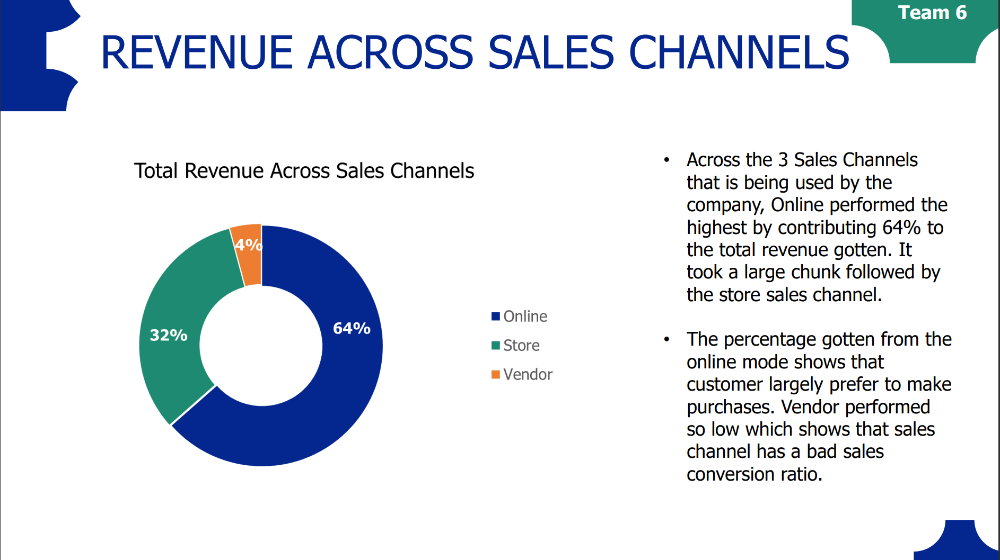

# DATALEUM-TEAM-6-EXCEL-PROJECT
This Project contains an Excel Project from Dataleum that was given to a team of 3 people. The Analysis of Vintage Couture store was done to help give valuable insights to make decisions. 
## Table of Content
1.0 - Introduction

2.0 - Data Source

3.0 - Tools Used

4.0 - Data Transformation

5.0 - Data Visualizations

6.0 - Insights

7.0 - Recommendation

## 1.0 - Introduction
The Aim of the analysis aims to summarize the company sales performance from January 2022 to December 2022. This Analysis was done to obtain sales performance across different criteria. The analysis was necessary to help the company make data driven decisions.

## 2.0 - Data Source
The Data Source for this Vintage Couture Analysis was provided by Dataleum who gave us the project. The Dataset was given to my team in an Excel Format. 

## 3.0 - Tools Used
3.1 -**Microsoft Excel** [Download Here](www.microsoft.com)

3.2 -**Microsoft PowerPoint** [Download Here](https://www.microsoft.com/en-us/microsoft-365/powerpoint)

## 4.0 - Data Transformation
Using Microsoft Excel, we were able to check the data for any errors or inconsistencies that might alter the report, but we didn't find any. We spent time to understand the dataset and it was concluded that everything is clean and can be loaded for visualization. 

## 5.0 - Data Visualization
With the Data Already loaded in Microsoft Excel, we made some intereting visuals with the aid of the Pivot Table in Excel. Some key insights gotten from the dataset to help aid Sales Performance for the next year. 
With the aid of some of the visuals we created, we were able to highlights some of the necessary Key Performance Indicators that were needed to help improve sales for the next year. 

## 6.0 - Insights
There were some major insights gotten to help Vintage couture improve sales for the next year. They include the following;
6.1 - *It Showed that the Total Revenue Generated during the course of the year 2022, which also showed that march recorded the highest month with 1.6 Milllion USD sales*

6.2 - *It also showed that out of the all the age groups that patronized the company, the Young adult which comprised of youths patronized the company more, it was closely followed by Adult and Middle-aged Adult.*

6.3 - *It also showed that out of the six regions, the South-South recorded the highest revenue with 5.3 Million USD which was closely followed by South-East.*

6.4 - *It also showed that the most effective out of the sales channels was the Online method, followed by the Store method.*

6.5 - *It also showed the Top 5 states by revenue with Bauchi bringing in a total revenue of 2.5 Million USD while Plateau state recorded the lowest sales with 7 thousand USD.*

6.6 - *It also showed that more Women patronised Vintage Couture during the year 2022*

## 7.0 Recommendation
As a feedback which gotten from the insights suggests that the company need to do well in some key areas and we were able to list some recommendations below. 
7.1 - *Vintage Couture Should introduce Discounts and offers to male products to encourage patronage from the gender*

7.2 - *Awards and Incentives should be introduced to top Performing vendors in the sales channel to motivate them work harder and bring in more money for the company*

7.3 - *More Marketing campaigns should be done by the company to low performing regions especially the South-West to boost revenue*

7.4 - *More Promotional Materials should be created in Under-performing states like Plateau, Taraba and Lagos.*
